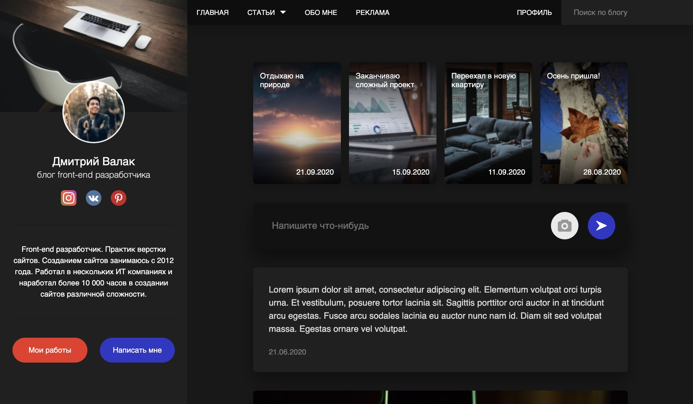

# Developer Blog

Multi-page responsive blog layout built from a Figma design.

## Technologies

* HTML5
* CSS3
* Flexbox
* CSS Grid
* BEM Methodology

## Pages

* Home Page
* Article Page
* Works Page
* Authentication Page

## Features

* Responsive design for desktop, tablet, and mobile devices
* Semantic HTML markup
* Multi-page website structure
* Consistent UI design across all pages
* Modern CSS architecture
* Hover animations and interactive states
* Optimized project structure
* Mobile-ready layout

## Project Preview

## Live Demo

https://developer-blog.vercel.app/

## Repository

https://github.com/KamDiaV/developer-blog
